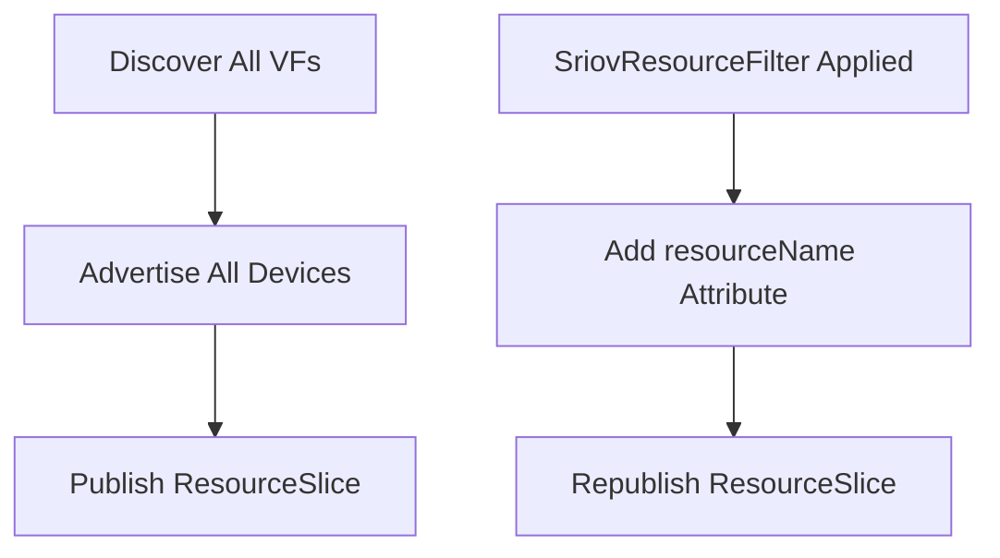
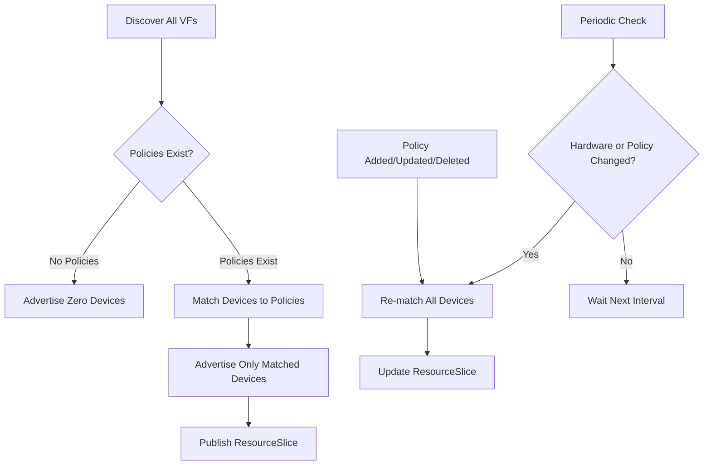
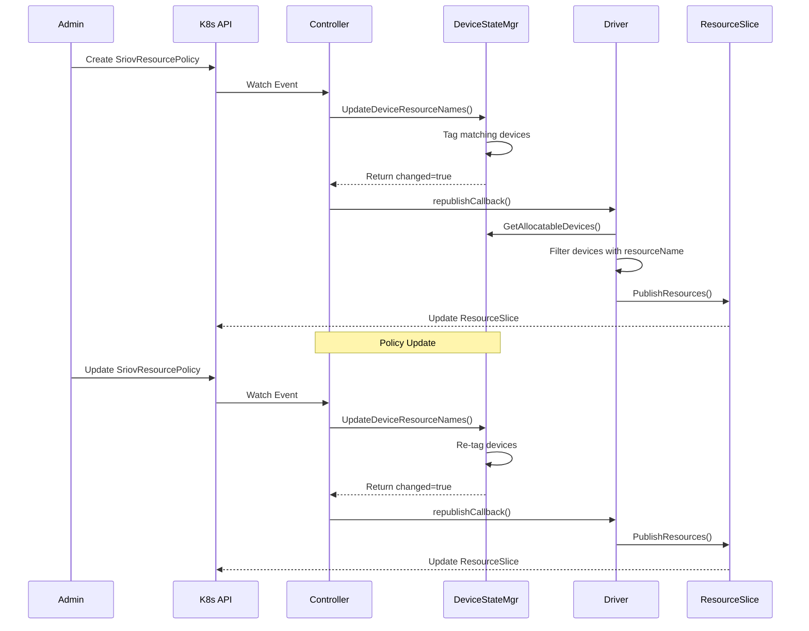

# Design: Opt-In Device Advertisement via SriovResourcePolicy

**Status:** Proposed  
**Date:** 2026-02-16  
**Authors:** rollandf

## Overview

This design proposes changing the SR-IOV DRA driver from advertising all discovered devices by default to an explicit opt-in model where devices are only advertised when matching a `SriovResourcePolicy` Custom Resource. This change improves security, resource management, and cluster administrator control over which SR-IOV devices are exposed as Kubernetes resources.

## Motivation

### Current Behavior

Today, the DRA driver:
1. Discovers all SR-IOV Virtual Functions (VFs) on node startup
2. Advertises **all** discovered VFs via ResourceSlice immediately
3. Uses `SriovResourceFilter` CR to tag devices with `resourceName` attributes
4. Filtering is metadata-only; all devices remain advertised

### Problems with Current Approach

1. **Security Risk:** All SR-IOV devices are exposed by default, even if not intended for cluster use
2. **Resource Pollution:** ResourceSlices contain devices that may never be allocated
3. **No Intentional Control:** No way to explicitly hide devices from Kubernetes
4. **Naming Confusion:** "Filter" implies exclusion, but it only adds metadata
5. **Incompatible with SR-IOV Network Operator Integration:** Cannot serve as a drop-in replacement for sriov-device-plugin in the SR-IOV Network Operator ecosystem

### Strategic Rationale: SR-IOV Network Operator Integration

A primary driver for this architectural change is enabling `dra-driver-sriov` to function as a **replacement for sriov-device-plugin** within the [SR-IOV Network Operator](https://github.com/k8snetworkplumbingwg/sriov-network-operator) ecosystem.

**Current sriov-device-plugin behavior:**
- Does **not** advertise devices by default
- Requires explicit `SriovNetworkNodePolicy` CRs to configure which devices to expose
- Provides fine-grained control over device pools and resource names
- Operators explicitly define device selection criteria before any resources are advertised

**Why this matters:**
1. **Operational Consistency:** SR-IOV Network Operator users expect explicit opt-in behavior, not automatic advertisement of all devices
2. **Migration Path:** Organizations using SR-IOV Network Operator can migrate to DRA without changing operational workflows
3. **Ecosystem Compatibility:** Aligns with established SR-IOV management patterns in Kubernetes
4. **Production Safety:** Prevents accidental exposure of sensitive network devices during operator-managed deployments

By adopting an opt-in model with `SriovResourcePolicy`, `dra-driver-sriov` will mirror the operational model of `sriov-device-plugin`, making it a viable DRA-based successor that integrates seamlessly with SR-IOV Network Operator's existing policy-driven approach.

This alignment is critical for adoption in production environments where SR-IOV Network Operator is already deployed and managing SR-IOV device lifecycle.

### Proposed Behavior

With this design:
1. Driver discovers all VFs but **does not advertise** them by default
2. Devices are **only advertised** when they match a `SriovResourcePolicy` CR
3. No matching policy = zero devices advertised (explicit opt-in)
4. Dynamic updates when policies change or devices are added/removed
5. Periodic reconciliation ensures ResourceSlice stays in sync

## Goals

- Change to explicit opt-in model for device advertisement
- Rename `SriovResourceFilter` to `SriovResourcePolicy` (reflects purpose better)
- Support dynamic ResourceSlice updates when policies or hardware changes
- Implement periodic sync to detect hardware changes
- Maintain clean architecture with minimal disruption

## Non-Goals

- Backward compatibility with old `SriovResourceFilter` CR name (clean break)
- Automatic migration of existing CRs (manual migration with tooling/docs)
- Changes to device preparation or allocation logic
- Changes to CDI, CNI, or NRI integration

## Design Details

### 1. API Changes: Rename to SriovResourcePolicy

#### CRD Rename

**Before:** `SriovResourceFilter`  
**After:** `SriovResourcePolicy`

```yaml
apiVersion: sriovnetwork.k8snetworkplumbingwg.io/v1alpha1
kind: SriovResourcePolicy
metadata:
  name: intel-high-perf-nics
  namespace: dra-sriov-driver
spec:
  nodeSelector:
    kubernetes.io/hostname: worker-node-1
  configs:
  - resourceName: "intel-high-perf"
    resourceFilters:
    - vendors: ["8086"]
      devices: ["159b"]
      pfNames: ["eth0"]
      numaNodes: ["0"]
```

**Rationale:** "Policy" better reflects that this CR controls which devices are exposed as resources, not just filtering/tagging.

#### Files to Update

1. **API Types:** `pkg/api/sriovdra/v1alpha1/api.go`
   - Rename all types: `SriovResourcePolicy`, `SriovResourcePolicySpec`, `SriovResourcePolicyList`
   - Update JSON tags and documentation

2. **CRD YAML:** `deployments/helm/dra-driver-sriov/templates/sriovnetwork.k8snetworkplumbingwg.io_sriovresourcepolicies.yaml`
   - Rename file and update Kind

3. **Controller:** `pkg/controller/resourcefiltercontroller.go`
   - Rename to `resourcepolicycontroller.go`
   - Update reconciler: `SriovResourcePolicyReconciler`

4. **RBAC:** `deployments/helm/dra-driver-sriov/templates/clusterrole.yaml`
   - Update resource names

5. **Demo/Examples:** `demo/resource-filtering/`
   - Rename directory to `resource-policies/`
   - Update all example manifests

### 2. Behavioral Changes: Opt-In Model

#### Current Flow



#### Proposed Flow



#### Key Changes

1. **Initial State:** Empty ResourceSlice (zero devices) until policy is applied
2. **Device Matching:** Only devices matching at least one policy are advertised
3. **Policy Lifecycle:**
   - **Create/Update:** Re-evaluate all devices, update ResourceSlice
   - **Delete:** Remove devices that only matched deleted policy, update ResourceSlice
4. **No Policy:** If all policies are deleted or none match the node, advertise zero devices

### 3. Controller Logic Updates

#### Current Implementation Issues

Current `resourcefiltercontroller.go` (lines 73-136):
- Supports multiple matching filters per node
- Uses unclear logic when multiple filters match
- Always republishes even if no devices match

#### Proposed Implementation

**File:** `pkg/controller/resourcepolicycontroller.go`

##### Reconciliation Algorithm

```go
func (r *SriovResourcePolicyReconciler) Reconcile(ctx context.Context, req reconcile.Request) (reconcile.Result, error) {
    // 1. Get the current node to check its labels
    node := &metav1.PartialObjectMetadata{}
    node.SetGroupVersionKind(corev1.SchemeGroupVersion.WithKind("Node"))
    if err := r.Get(ctx, types.NamespacedName{Name: r.nodeName}, node); err != nil {
        return ctrl.Result{}, err
    }
    
    // 2. List all SriovResourcePolicy objects in the operator namespace
    policies := &v1alpha1.SriovResourcePolicyList{}
    if err := r.Client.List(ctx, policies, client.InNamespace(r.namespace)); err != nil {
        return ctrl.Result{}, err
    }
    
    // 3. Filter policies that match this node's labels
    matchingPolicies := filterPoliciesByNodeSelector(policies.Items, node.Labels)
    
    // 4. Build device-to-resourceName mapping
    deviceResourceMap := make(map[string]string)
    for _, policy := range matchingPolicies {
        for _, config := range policy.Spec.Configs {
            matchedDevices := r.matchDevicesToFilters(config.ResourceFilters)
            for _, device := range matchedDevices {
                deviceResourceMap[device] = config.ResourceName
            }
        }
    }
    
    // 5. Update device state manager with new mapping
    // This will automatically trigger republish callback if changes were made
    if err := r.deviceStateManager.UpdateDeviceResourceNames(ctx, deviceResourceMap); err != nil {
        return reconcile.Result{}, err
    }
    
    return reconcile.Result{}, nil
}
```

##### Device Matching Logic

**Current:** Multiple filters use OR logic (any match), attributes within filter use AND logic  
**Proposed:** Same logic, but non-matching devices are **excluded** from ResourceSlice

```go
func (r *SriovResourcePolicyReconciler) matchDevicesToFilters(filters []v1alpha1.ResourceFilter) []string {
    allDevices := r.DeviceStateManager.GetAllocatableDevices()
    matchedDeviceNames := []string{}
    
    for deviceName, device := range allDevices {
        // Check if device matches ANY of the resource filters (OR logic)
        for _, filter := range filters {
            if deviceMatchesFilter(device, filter) {
                matchedDeviceNames = append(matchedDeviceNames, deviceName)
                break // Device matched, no need to check other filters
            }
        }
    }
    
    return matchedDeviceNames
}
```

### 4. ResourceSlice Management Strategy

#### Current Implementation

**File:** `pkg/driver/driver.go` (line 144)

```go
func (d *Driver) PublishResources(ctx context.Context) error {
    // Gets ALL devices
    devices := d.deviceStateManager.GetAllocatableDevices()
    
    // Publishes ALL devices
    resources := resourceslice.DriverResources{
        Pools: map[string]resourceslice.Pool{
            d.nodeName: {
                Slices: []resourceslice.Slice{
                    {Devices: convertToSlice(devices)},
                },
            },
        },
    }
    
    return d.helper.PublishResources(ctx, resources)
}
```

#### Proposed Implementation

Add filtering logic to only include devices with `resourceName` attribute:

```go
func (d *Driver) PublishResources(ctx context.Context) error {
    // Get all discovered devices
    allDevices := d.deviceStateManager.GetAllocatableDevices()
    
    // Filter to only devices with resourceName attribute (matched by policy)
    advertisedDevices := filterDevicesWithResourceName(allDevices)
    
    // Publish only matched devices
    resources := resourceslice.DriverResources{
        Pools: map[string]resourceslice.Pool{
            d.nodeName: {
                Slices: []resourceslice.Slice{
                    {Devices: convertToSlice(advertisedDevices)},
                },
            },
        },
    }
    
    return d.helper.PublishResources(ctx, resources)
}

func filterDevicesWithResourceName(devices map[string]resourceapi.Device) map[string]resourceapi.Device {
    filtered := make(map[string]resourceapi.Device)
    for name, device := range devices {
        // Check if device has resourceName attribute set by policy
        if resourceName, exists := device.Attributes[consts.AttributeResourceName]; exists && resourceName.StringValue != nil && *resourceName.StringValue != "" {
            filtered[name] = device
        }
    }
    return filtered
}
```

#### ResourceSlice Lifecycle



### 5. Periodic Sync Mechanism

#### Rationale

Event-driven updates may miss:
1. **Hardware hotplug:** New VFs added without driver restart
2. **Hardware removal:** VFs removed physically
3. **Out-of-band changes:** Direct sysfs manipulation
4. **Missed events:** Controller downtime or event loss

#### Design

**Strategy:** Event-driven primary + periodic fallback

##### Implementation Approach

Add periodic sync to `pkg/driver/driver.go`:

```go
type Driver struct {
    // ... existing fields ...
    syncInterval time.Duration
    syncTicker   *time.Ticker
}

func (d *Driver) Start(ctx context.Context) error {
    // ... existing startup logic ...
    
    // Start periodic sync goroutine
    d.syncTicker = time.NewTicker(d.syncInterval)
    go d.periodicSyncLoop(ctx)
    
    return nil
}

func (d *Driver) periodicSyncLoop(ctx context.Context) {
    for {
        select {
        case <-ctx.Done():
            d.syncTicker.Stop()
            return
        case <-d.syncTicker.C:
            if err := d.syncDevicesAndResources(ctx); err != nil {
                klog.Errorf("Periodic sync failed: %v", err)
            }
        }
    }
}

func (d *Driver) syncDevicesAndResources(ctx context.Context) error {
    // 1. Re-discover devices
    newDevices, err := devicestate.DiscoverSriovDevices()
    if err != nil {
        return fmt.Errorf("device discovery failed: %w", err)
    }
    
    // 2. Compare with current state
    // Detects both device additions/removals and attribute changes (e.g., NUMA node)
    currentDevices := d.deviceStateManager.GetAllocatableDevices()
    changed := deviceSetsAreDifferent(currentDevices, newDevices)
    
    // 3. If devices changed, update and republish
    if changed {
        klog.Info("Periodic sync detected device changes, updating ResourceSlice")
        d.deviceStateManager.SetAllocatableDevices(newDevices)
        
        // Re-apply policies to new device set
        if err := d.reapplyPolicies(ctx); err != nil {
            return fmt.Errorf("failed to reapply policies: %w", err)
        }
        
        return d.PublishResources(ctx)
    }
    
    return nil
}

func deviceSetsAreDifferent(current, new map[string]resourceapi.Device) bool {
    // Check if device count changed
    if len(current) != len(new) {
        return true
    }
    
    // Check for missing devices or attribute changes
    for name, currentDevice := range current {
        newDevice, exists := new[name]
        if !exists {
            return true
        }
        
        // Compare device attributes using deep equality
        // This catches changes in NUMA node, capacity, attributes, etc.
        if !reflect.DeepEqual(currentDevice, newDevice) {
            return true
        }
    }
    
    return false
}

func (d *Driver) reapplyPolicies(ctx context.Context) error {
    // Trigger the policy controller to reconcile and reapply policies to the updated device set
    // This is CRITICAL because:
    // 1. New devices need to be matched against existing policies to get resourceName attribute
    // 2. Without resourceName, PublishResources() won't advertise them (opt-in model)
    // 3. Simply calling republishCallback() is insufficient - it only publishes devices
    //    that already have resourceName set
    
    // Direct controller trigger approach:
    // The driver must hold a reference to the policy controller to trigger reconciliation
    // after device discovery. This coupling is necessary for the periodic sync to work correctly.
    if d.policyController != nil {
        return d.policyController.Reconcile(ctx, ctrl.Request{
            NamespacedName: types.NamespacedName{
                Namespace: d.namespace,
                Name:      "periodic-sync-trigger",
            },
        })
    }
    
    // If controller reference is not available, log error
    // Without this, new devices discovered during sync won't be advertised
    klog.Error(nil, "Policy controller reference not available - new devices cannot be advertised")
    return fmt.Errorf("policy controller reference required for reapplying policies")
}
```

**Implementation Requirements:**

To support this, the Driver struct needs to hold a reference to the policy controller:

```go
type Driver struct {
    // ... existing fields ...
    policyController *controller.SriovResourcePolicyReconciler
    namespace        string
}
```

And in `cmd/dra-driver-sriov/main.go`, pass the controller to the driver during initialization:

```go
// Create policy controller
policyController := controller.NewSriovResourcePolicyReconciler(...)

// Create driver with controller reference
driver := driver.NewDriver(config, deviceStateManager, podManager, policyController)
```

**Why this coupling is necessary:**

The periodic sync flow requires this sequence:
1. Discover new devices → `deviceStateManager.SetAllocatableDevices(newDevices)`
2. Trigger controller → controller matches devices against policies
3. Controller calls → `deviceStateManager.UpdateDeviceResourceNames()` to set resourceName
4. Controller triggers → `republishCallback()` → `PublishResources()`
5. PublishResources filters devices → only those with resourceName are advertised

Without step 2, newly discovered devices remain in the device state but are never advertised because they lack the resourceName attribute.

##### Configuration

Add CLI flag in `cmd/dra-driver-sriov/main.go`:

```go
var (
    // ... existing flags ...
    syncInterval = flag.Duration("sync-interval", 5*time.Minute, "Interval for periodic device and resource synchronization")
)
```

##### Sync Interval Recommendations

- **Default:** 5 minutes (balance between responsiveness and overhead)
- **Minimum:** 1 minute (prevent excessive overhead)
- **Production:** 5-10 minutes (hardware changes are rare)
- **Development/Testing:** 30 seconds (faster iteration)

### 6. Device State Manager Updates

#### Current Implementation

**File:** `pkg/devicestate/state.go`

Current `UpdateDeviceResourceNames()` (lines 64-81):
- Takes map of device name → resource name
- Updates device attributes
- Calls republish callback if changes detected

#### Thread Safety Requirements

**CRITICAL:** The introduction of the periodic sync goroutine creates guaranteed concurrent access to the device state. The Manager MUST be made thread-safe to prevent race conditions between:
- Periodic sync goroutine: reads/writes `allocatable` map
- Controller reconciliation: writes `allocatable` map via `UpdateDeviceResourceNames()`
- Driver publishing: reads `allocatable` map via `GetAdvertisableDevices()`

**Recommendation:** Add a `sync.RWMutex` to the Manager struct and protect all access to the `allocatable` map:
```go
type Manager struct {
    mu                sync.RWMutex  // Protects allocatable map
    allocatable       map[string]resourceapi.Device
    // ... other fields ...
}
```

All methods that access `allocatable` should use appropriate locking:
- Read operations: `mu.RLock()` / `mu.RUnlock()`
  - `GetAllocatableDevices()`
  - `GetAdvertisableDevices()` (new method)
- Write operations: `mu.Lock()` / `mu.Unlock()`
  - `SetAllocatableDevices()`
  - `UpdateDeviceResourceNames()`
  - Any other method that modifies the `allocatable` map

#### Proposed Updates

Add helper method to support opt-in filtering:

```go
// GetAdvertisableDevices returns only devices with resourceName attribute
// Thread-safe: Uses read lock for concurrent access safety
func (m *Manager) GetAdvertisableDevices() map[string]resourceapi.Device {
    m.mu.RLock()
    defer m.mu.RUnlock()
    
    advertisable := make(map[string]resourceapi.Device)
    for name, device := range m.allocatable {
        if resourceName, exists := device.Attributes[consts.AttributeResourceName]; exists {
            if resourceName.StringValue != nil && *resourceName.StringValue != "" {
                advertisable[name] = device
            }
        }
    }
    return advertisable
}

// UpdateDeviceResourceNames updates resource names and triggers republish if changes occurred
// This method is already implemented efficiently in pkg/devicestate/state.go (lines 304-377)
// Thread-safe: Uses write lock for exclusive access during modifications
// Key implementation details:
//
// 1. Process devices in deviceResourceMap:
//    - Set/update resourceName only if value changed (avoid redundant updates)
//    - Clear resourceName if empty string provided
//
// 2. Clear resourceName from devices NOT in the map:
//    - Only clear if attribute exists (avoid redundant operations)
//
// 3. Track changes accurately:
//    - Only set changed flag when actual modifications occur
//    - Prevents unnecessary ResourceSlice republishing
//
// 4. Trigger republish callback if changes made:
//    - Ensures ResourceSlice reflects current state
//
// Example efficient logic with thread safety:
func (m *Manager) UpdateDeviceResourceNames(ctx context.Context, deviceResourceMap map[string]string) error {
    m.mu.Lock()
    defer m.mu.Unlock()
    
    changesMade := false
    
    // Update/add resource names for devices in the map
    for deviceName, resourceName := range deviceResourceMap {
        if device, exists := m.allocatable[deviceName]; exists {
            if resourceName != "" {
                // Only update if value changed
                if existingAttr, exists := device.Attributes[consts.AttributeResourceName]; !exists ||
                    existingAttr.StringValue == nil || *existingAttr.StringValue != resourceName {
                    device.Attributes[consts.AttributeResourceName] = resourceapi.DeviceAttribute{
                        StringValue: &resourceName,
                    }
                    m.allocatable[deviceName] = device
                    changesMade = true
                }
            } else {
                // Clear if empty string and attribute exists
                if _, exists := device.Attributes[consts.AttributeResourceName]; exists {
                    delete(device.Attributes, consts.AttributeResourceName)
                    m.allocatable[deviceName] = device
                    changesMade = true
                }
            }
        }
    }
    
    // Clear resourceName for devices not in the map
    for deviceName, device := range m.allocatable {
        if _, inMap := deviceResourceMap[deviceName]; !inMap {
            if _, exists := device.Attributes[consts.AttributeResourceName]; exists {
                delete(device.Attributes, consts.AttributeResourceName)
                m.allocatable[deviceName] = device
                changesMade = true
            }
        }
    }
    
    // Trigger republish callback if changes were made
    if changesMade && m.republishCallback != nil {
        return m.republishCallback(ctx)
    }
    
    return nil
}
```

Update `PublishResources()` to use new method:

```go
func (d *Driver) PublishResources(ctx context.Context) error {
    // Use GetAdvertisableDevices instead of GetAllocatableDevices
    devices := d.deviceStateManager.GetAdvertisableDevices()
    
    resources := resourceslice.DriverResources{
        Pools: map[string]resourceslice.Pool{
            d.nodeName: {
                Slices: []resourceslice.Slice{
                    {Devices: convertToSlice(devices)},
                },
            },
        },
    }
    
    return d.helper.PublishResources(ctx, resources)
}
```

### 7. Edge Cases and Error Handling

#### Scenario 1: No Policies Match Node

**Behavior:** Advertise zero devices

**Implementation:**
- Controller reconciles, finds no matching policies
- Calls `UpdateDeviceResourceNames(empty map)`
- All devices have `resourceName` cleared
- `PublishResources()` publishes empty device list

#### Scenario 2: Policy Deleted While Devices Allocated

**Behavior:** Devices remain allocated, but new allocations fail

**Implementation:**
- Controller detects deletion
- Updates ResourceSlice to remove devices
- Already-allocated devices remain bound to pods
- `UnprepareResourceClaims` proceeds normally on pod termination

**Note:** This is safe because DRA ResourceClaims are immutable once allocated.

#### Scenario 3: Multiple Policies Match Same Device

**Behavior:** Device gets `resourceName` from first matching policy

**Implementation:**
- Controller iterates policies in order
- First matching policy's `resourceName` wins
- Document this behavior in CRD description

**Alternative:** Use priority field or reject overlapping policies (future enhancement)

#### Scenario 4: Hardware Hotplug During Sync

**Behavior:** Next periodic sync detects change

**Timing:**
- Hotplug event occurs
- OS detects new VF
- Next sync interval (≤5 min): driver detects new VF
- Policies reapplied
- ResourceSlice updated

**Optimization (Future):** Subscribe to udev events for immediate detection

#### Scenario 5: Sync Fails Due to API Error

**Behavior:** Log error, retry on next interval

**Implementation:**
```go
func (d *Driver) syncDevicesAndResources(ctx context.Context) error {
    if err := /* sync logic */; err != nil {
        klog.Errorf("Sync failed: %v", err)
        return err
    }
    return nil
}
```

Metrics should track sync failures for monitoring.

### 8. Migration Guide

Since we're not providing backward compatibility, administrators must manually migrate.

#### Migration Steps

1. **Backup Existing Resources**
   ```bash
   kubectl get sriovresourcefilters -n dra-sriov-driver -o yaml > backup.yaml
   ```

2. **Update CRD**
   ```bash
   # Delete old CRD
   kubectl delete crd sriovresourcefilters.sriovnetwork.k8snetworkplumbingwg.io
   
   # Apply new CRD
   kubectl apply -f sriovresourcepolicies.yaml
   ```

3. **Convert Manifests**
   ```bash
   # Use sed to convert all occurrences (handles both singular and list kinds)
   sed -e 's/kind: SriovResourceFilter$/kind: SriovResourcePolicy/g' \
       -e 's/kind: SriovResourceFilterList$/kind: SriovResourcePolicyList/g' \
       -e 's/SriovResourceFilterSpec/SriovResourcePolicySpec/g' \
       backup.yaml > final.yaml
   
   # Verify the conversion
   grep -E "kind:|SriovResource" final.yaml
   ```

4. **Apply New Policies**
   ```bash
   kubectl apply -f final.yaml
   ```

5. **Upgrade Driver**
   ```bash
   helm upgrade dra-driver-sriov ./deployments/helm/dra-driver-sriov \
     --namespace dra-sriov-driver \
     --set syncInterval=5m
   ```

6. **Verify**
   ```bash
   # Check policies
   kubectl get sriovresourcepolicies -n dra-sriov-driver
   
   # Check ResourceSlices
   kubectl get resourceslices -l driver=sriovnetwork.k8snetworkplumbingwg.io
   ```

#### Breaking Changes

- **CRD Rename:** `SriovResourceFilter` → `SriovResourcePolicy`
- **Default Behavior:** All devices advertised → Zero devices advertised
- **Migration Required:** No automatic conversion

### 9. Testing Strategy

#### Unit Tests

1. **Controller Tests** (`pkg/controller/resourcepolicycontroller_test.go`)
   - Test policy matching logic
   - Test device filtering with various criteria
   - Test empty policy list handling
   - Test multiple policies matching same device

2. **Device State Manager Tests** (`pkg/devicestate/state_test.go`)
   - Test `GetAdvertisableDevices()` filtering
   - Test `UpdateDeviceResourceNames()` with empty map
   - Test resource name clearing

3. **Driver Tests** (`pkg/driver/driver_test.go`)
   - Test `PublishResources()` with filtered devices
   - Test sync logic with device changes

#### Integration Tests

1. **Opt-In Behavior**
   - Start driver with no policies → verify zero devices advertised
   - Create policy → verify matching devices advertised
   - Delete policy → verify devices removed

2. **Dynamic Updates**
   - Update policy filters → verify ResourceSlice updates
   - Add second policy → verify additional devices advertised
   - Remove one of multiple policies → verify only its devices removed

3. **Periodic Sync**
   - Simulate device hotplug → verify next sync detects it
   - Simulate device removal → verify next sync updates ResourceSlice

4. **Edge Cases**
   - Delete policy with allocated devices → verify allocation continues
   - Multiple policies matching same device → verify first wins

#### E2E Tests

1. **Policy Lifecycle**
   - Deploy driver
   - Create policy
   - Deploy workload requesting resources
   - Update policy (add more devices)
   - Deploy second workload
   - Delete policies
   - Verify workloads continue running

2. **Sync Validation**
   - Deploy with short sync interval (30s)
   - Manually trigger VF creation (if possible in test env)
   - Verify detection within 30s

## Implementation Plan

### 1. API Changes
- [ ] Rename CRD: `SriovResourceFilter` → `SriovResourcePolicy`
- [ ] Update API types in `pkg/api/sriovdra/v1alpha1/`
- [ ] Update CRD YAML files
- [ ] Update RBAC resources
- [ ] Update demo examples

### 2. Controller Updates
- [ ] Rename controller file and structs
- [ ] Update reconciliation logic
- [ ] Add device filtering in `UpdateDeviceResourceNames()`
- [ ] Add unit tests for new behavior

### 3. Driver Updates
- [ ] Add `GetAdvertisableDevices()` to device state manager
- [ ] Update `PublishResources()` to filter devices
- [ ] Add unit tests for filtering logic

### 4. Periodic Sync
- [ ] Implement periodic sync loop in driver
- [ ] Add device discovery re-run logic
- [ ] Add device set comparison logic
- [ ] Add CLI flag for sync interval
- [ ] Add unit tests for sync logic

### 5. Testing
- [ ] Add comprehensive unit tests
- [ ] Add integration tests
- [ ] Add E2E tests
- [ ] Manual testing on real hardware

### 6. Documentation
- [ ] Update README
- [ ] Write migration guide
- [ ] Update Helm chart documentation
- [ ] Update API documentation
- [ ] Add troubleshooting guide

## Security Considerations

### Improvements

1. **Reduced Attack Surface:** Devices not explicitly allowed are not exposed
2. **Principle of Least Privilege:** Administrators must explicitly grant access
3. **Namespace Isolation:** Policies are namespace-scoped

### Risks

1. **Misconfiguration:** Incorrect policies may prevent legitimate workloads from running
2. **RBAC:** Need proper RBAC to prevent unauthorized policy creation

### Recommendations

1. Add validating webhook to reject invalid policies
2. Add policy status field showing matched devices (for debugging)
3. Add audit logging for policy changes

## Alternatives Considered

### Alternative 1: Keep Current Name

**Pros:** No migration needed, less disruption  
**Cons:** Name doesn't reflect new behavior, confusing to users  
**Decision:** Rejected - clean naming improves long-term maintainability

### Alternative 2: Support Both CRs (Backward Compatible)

**Pros:** Smooth migration, no breaking changes  
**Cons:** Code complexity, technical debt, confusion about which CR to use  
**Decision:** Rejected - clean break is clearer

### Alternative 3: Flag to Enable Opt-In Mode

**Pros:** Gradual migration, backward compatible  
**Cons:** Two modes increase testing burden, unclear default for new users  
**Decision:** Rejected - opt-in should be the only mode

### Alternative 4: Event-Driven Sync Only (No Periodic)

**Pros:** Lower overhead, simpler code  
**Cons:** May miss hardware changes (hotplug, out-of-band changes)  
**Decision:** Rejected - periodic sync provides robustness

## Open Questions

1. **Webhook Validation:** Should we add a validating webhook to enforce policy constraints?
   - Prevents invalid policies (e.g., empty filters)
   - Adds complexity and deployment overhead

2. **Policy Priority:** Should we support priority fields for overlapping policies?
   - Useful for complex scenarios
   - Adds complexity

3. **Status Field:** Should policies have a status showing matched devices?
   - Great for debugging
   - Requires status updates (extra API calls)

4. **Hotplug Events:** Should we integrate udev events for immediate hotplug detection?
   - Faster than periodic sync
   - Platform-specific, more complex

## Success Criteria

- [ ] Zero devices advertised when no policies exist
- [ ] Only devices matching policies are advertised
- [ ] ResourceSlice updates within 5 minutes of hardware changes (periodic sync)
- [ ] ResourceSlice updates immediately on policy changes (event-driven)
- [ ] All existing tests pass with updated logic
- [ ] Migration guide successfully tested
- [ ] Performance overhead <1% CPU, <50MB memory

## References

- [Kubernetes Dynamic Resource Allocation (DRA)](https://kubernetes.io/docs/concepts/scheduling-eviction/dynamic-resource-allocation/)
- [SR-IOV Device Plugin](https://github.com/k8snetworkplumbingwg/sriov-network-device-plugin)
- [Container Device Interface (CDI)](https://github.com/cncf-tags/container-device-interface)
- Current implementation: `pkg/controller/resourcefiltercontroller.go`
- Current discovery: `pkg/devicestate/discovery.go`
- Current driver: `pkg/driver/driver.go`
